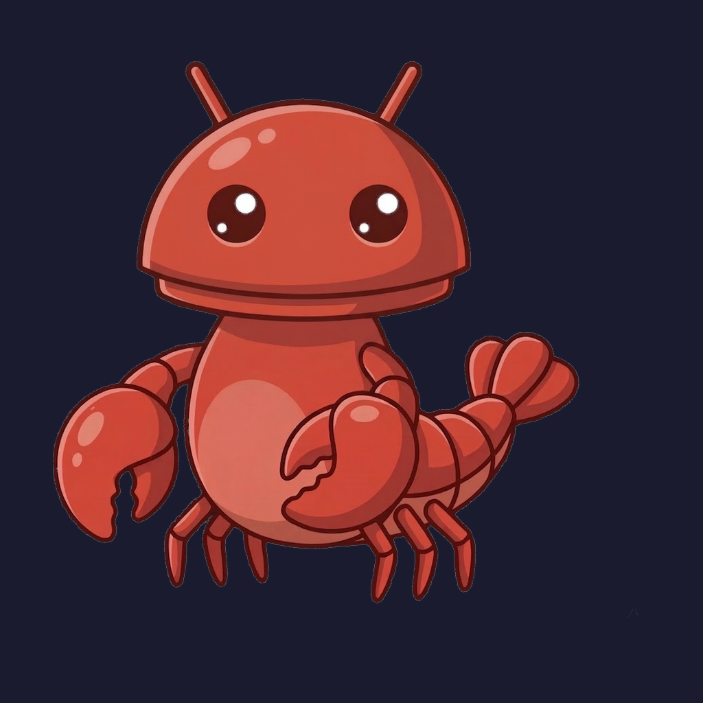
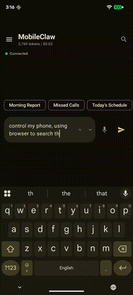

<p align="center">
  
</p>

<h1 align="center">MobileClaw</h1>

<p align="center">
  <strong>Your phone is the agent.</strong><br>
  An open-source AI that controls your Android phone with natural language.
</p>

<p align="center">
  <a href="LICENSE"></a>
  <a href="#"></a>
  <a href="#"></a>
  <a href="#"></a>
</p>

<p align="center">
  <a href="#quick-start">Quick Start</a> &bull;
  <a href="#on-device-ai">On-Device AI</a> &bull;
  <a href="#tools">Tools</a> &bull;
  <a href="https://chenkuansun.github.io/MobileClaw/">Website</a>
</p>

---

MobileClaw is the Android port of [OpenClaw](https://github.com/openclaw/openclaw). It turns your phone into an AI agent — tell it what to do in plain English and it taps, types, reads, calls, and navigates for you. Runs with **cloud AI** (Claude, GPT, Gemini, 10 providers) or **entirely offline** with Gemma 4 on-device.

No server. No subscription. Your phone does everything.

<p align="center">
  
</p>

## Why MobileClaw?

| | MobileClaw | Other AI Assistants |
|---|---|---|
| **Runs on your phone** | Everything local. No backend. | Requires cloud servers |
| **Controls any app** | AccessibilityService taps, swipes, types in ANY app | Limited to their own UI |
| **On-device AI** | Gemma 4 with GPU — no internet needed | Always needs internet |
| **Open source** | Apache 2.0. Fork it, modify it, own it | Closed source |
| **Multi-provider** | 10 cloud + on-device. Bring your own keys | Locked to one vendor |
| **Extensible** | 21 skills as Markdown. Create your own in-app | Fixed capabilities |

## On-Device AI

Run **Gemma 4** directly on your phone via [LiteRT-LM](https://github.com/google-ai-edge/LiteRT-LM). No API key. No internet. No cost.

- **E2B** (2.6 GB) — 6 GB+ RAM, ~9 tok/s on GPU
- **E4B** (3.7 GB) — 8 GB+ RAM, higher quality responses
- **GPU accelerated** with NPU/CPU fallback (auto-detected)
- **Tool calling** works on-device via constrained decoding
- Download models from Settings, switch between cloud and local anytime

## Tools

29 native tools that directly access Android APIs:

| | | | |
|---|---|---|---|
| SMS | Call Log | Contacts | Phone Call |
| Calendar | Alarms | Notifications | App Launcher |
| Navigation | UI Automation | Screen Capture | Web Browser |
| HTTP API | File System | Photos | Clipboard |
| Media Control | Volume | Brightness | Flashlight |
| System Info | Scheduled Tasks | Skill Author | Memory |
| Session History | Sub-Agent | Channel | Telegram |
| OpenAI | | | |

Every tool works with both cloud and on-device models.

## Skills

21 composable skills (Markdown + YAML frontmatter):

**Built-in:** morning-routine, email, messaging-apps, navigation, notification-digest, phone-basics, photos, self-learning, social-media, telegram-bot, translation, ui-fallback, weather, web-research

**Vertical:** finance, health, notion, real-estate, shopping, smart-home, telegram

Create your own: describe what you want, and the AI writes the skill for you (`/create` command).

## Quick Start

```bash
git clone https://github.com/ChenKuanSun/mobileClaw.git
cd MobileClaw
./gradlew assembleDebug
```

Install the APK, then either:
- **Cloud:** Enter an API key (Anthropic, OpenAI, Google, etc.)
- **On-Device:** Go to Settings > AI Provider > On-Device > Download Gemma 4

Grant permissions as needed, enable Accessibility Service, and start chatting.

## Architecture

```
┌──────────────────────────────────────────┐
│           Jetpack Compose UI             │
│   ChatScreen · Skills · Settings         │
├──────────────────────────────────────────┤
│            AgentRuntime                  │
│   Tool-use loop with streaming           │
├────────────────┬─────────────────────────┤
│  29 Android    │   LiteRT-LM Engine      │
│  Tools (native)│   (Gemma 4 on-device)   │
├────────────────┴─────────────────────────┤
│  ClaudeApiClient · 10 Cloud Providers    │
├──────────────────────────────────────────┤
│  Room · DataStore · EncryptedPrefs       │
├──────────────────────────────────────────┤
│  AccessibilityService · Notifications    │
└──────────────────────────────────────────┘
```

**Stack:** Kotlin 2.2 · Jetpack Compose · Hilt · Room · LiteRT-LM 0.10 · Anthropic SDK · Ktor

## Contributing

See [CONTRIBUTING.md](CONTRIBUTING.md). PRs welcome.

## License

Apache 2.0 — see [LICENSE](LICENSE).

Built by [CK Sun](https://github.com/ChenKuanSun). Based on [OpenClaw](https://github.com/openclaw/openclaw).
